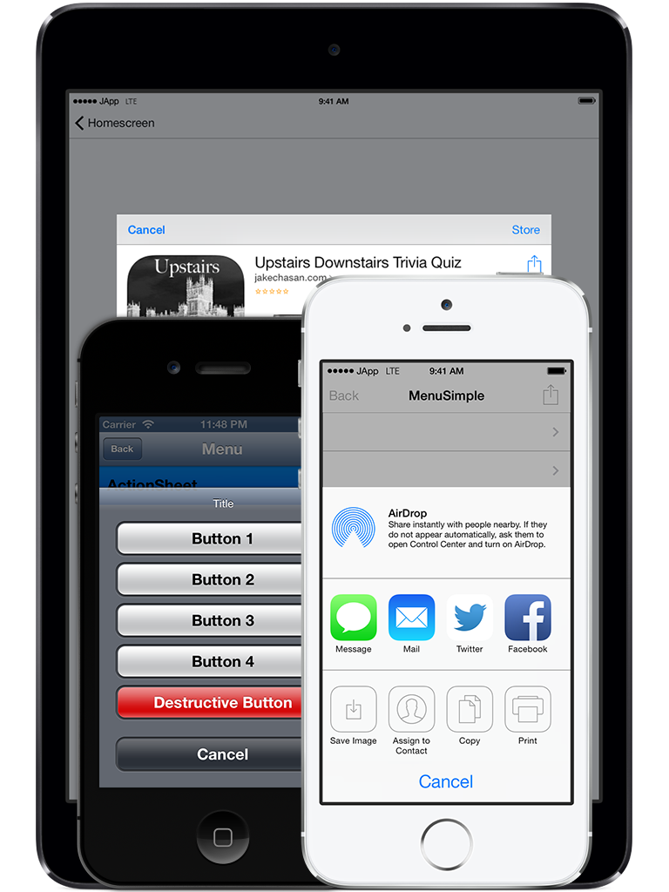

# Launch Screen Plugin for the Buzztouch Platform

## About Plugin
### Description
The Launch Screen plugin is ideal for an app developer who wants the customization of launching different plugins based on the user's device. This plugin allows the developer to configure which screen loads for iPhone 3.5 inch, iPhone 4.0 inch, and iPad. The developer can also configure a setting which loads different screens based on the iOS version the user is running. This plugin can also be configured to load no screen, which is ideal for "Lite" apps or apps which use list menus, however, do not want the rows leading to another screen. For best results, use the "fade" transition when loading this plugin.

Features:

-Load a Different Screen on iPhone 3.5 inch, iPhone 4.0 inch, and iPad

-Delay the loading of a screen

-Lock a screen until a specified date

--Configure Alert information to show until this date

-Allow no screen to load

### Version History
v1.0-Initial Release of Plugin

v1.1-Fixed problem loading screens on BT3.0 Core

--Fixed a typo in the control panel

v1.2-Compatibility with BT4.0 and iOS 10

v2.0-Complete refactoring of source code, reduced length by 70%

### iOS Project
JC_LaunchScreen.h

JC_LaunchScreen.m

### Android Project
This plugin is not compatible with Android.

### JSON Data
`{
 "itemId": "11223344",  
 "itemType": "JC_LaunchScreen",
 "itemNickname": "Launch Screen",
 "launchScreen": "1",
 "iPhone35LoadScreenNickname": "Screen 1",
 "iPhone35LoadScreenID": "10293847",
 "iPhone40LoadScreenNickname": "Screen 2",
 "iPhone40LoadScreenID": "01928374",
 "iPadLoadScreenNickname": "Screen 3",
 "iPadLoadScreenID": "56473829",
 "launchScreenDelay": "0.1",
 "iOSVersionLoad": "7.0",
 "iPhone35LoadScreenNicknameiOSVersion": "Screen 4",
 "iPhone35LoadScreenIDiOSVersion": "7869504",
 "iPhone40LoadScreenNicknameiOSVersion": "Screen 5",
 "iPhone40LoadScreenIDiOSVersion": "3425167",
 "iPadLoadScreenNicknameiOSVersion": "Screen 6",
 "iPadLoadScreenIDiOSVersion": "6758152"
 "launchWaitForDate": "1",
 "launchDateSet": "12-24-13",
 "launchDateAlertTitle": "Title",
 "launchDateAlertMessage": "Message"
}`

## Screenshots

## Installation
If a previous version of this plugin is installed on your server that was downloaded from the Buzztouch Plugin Market, we reccomend that you delete this plugin's folder under /filed/plugins/ and then upload the new package and refresh your plugin list.

## Questions and Answers
Can I use this plugin on my self-hosted Buzztouch account?

*Yes, you can download the plugin from this repository as a zip file, and upload it to your Buzztouch self-hosted Control Panel*

Can I use this plugin on apps hosted at Buzztouch.com?

*Yes, but you must install it through the [Buzztouch Plugin Market](http://www.buzztouch.com/plugins/plugin.php?pid=8901C4D9F816959026BE5D9).*

## Collaboration
To become a collaborator with this project, please contact us on either our [Twitter](http://twitter.com/jakechasan) or our [Facebook](http://facebook.com/jakechasanapps) pages.

## Support
For support and further questions, please contact us on either our [Twitter](http://twitter.com/jakechasan) or our [Facebook](http://facebook.com/jakechasanapps) pages.

Support is also availible from other Buzztouch users on the [Buzztouch Forums](http://www.buzztouch.com/forum/).
